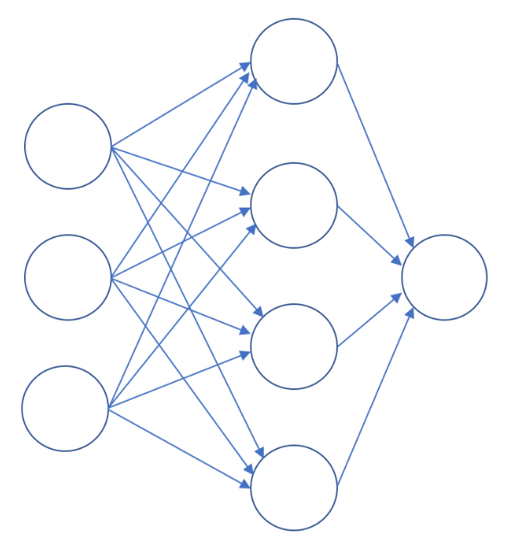
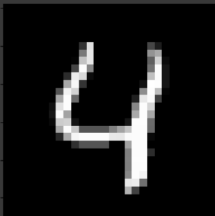

# What is a neural network?

Neural networks, a biologically-inspired programming paradigm which enables a computer to learn from observational data. It is inspired from th human brain which consists of 100 billion cells called neurons, connected together by synapses. So as the name suggests, **Neural**-> perceptron (mathematical model of a biological neuron), or something which contains number, has inputs and outputs, and **Network**-> a systematic way in which these neurons are connected to learn from observational data.

So simply saying, neural network is a graph of input and output neurons. For example:

This is a simple three layer network, one input layer, one hidden and one output layer. The image pixels are the input in DNN, and is making three very simple decisions, by weighing the input evidence. The output layer is the prediction made. The hidden layers, whose each of those perceptrons is making a decision by weighing up the results from the first layer of decision-making. In this way a perceptron in the second layer can make a decision at a more complex and more abstract level than perceptrons in the first layer. And even more complex decisions can be made by the perceptron in the third layer. In this way, a many-layer network of perceptrons can engage in sophisticated decision making.

One of the best example to undestand DNN is Handwritten digit recognition for which usually MNIST dataset is used, which contains 60,000 training images and 10,000 testing images taken from American Census Bureau employees and American high school students, like this:

Each pixel of this image will work as input in DNN, and our output layer will have 10 neuron representing the 10 digits of which only one should be activated to get the correct class. The main learning part will happen in the hidden layers as the pixel value inserted in the input layer will be activated upon some function (sigmoid, relu, tanh etc.) and a biase value can be added which will help the network to predict the near related pixel in the image. For example, through this NN will know "0" has round shape, "1" is linear and numbers like "9" will have round as wel as straight shape. So after training the NN will know the relation between each pixels and will create a score for final outputs and the final activation function will let us know then class it belongs to. In this way NN is used to train and predict data.

# Gradient descent - How neural networks learn?
To learn this technique we will devide this task in 3 **simple parts**-
<ol>
  <li>Understanding gradient descent.</li>
  <li> Using it in algorithms.</li>
  <li>Scaling it to very large datasets.</li>
</ol>

Now, since we know parts to learn we will know learn about them by little learning so we can **self-correct** ourself, and as the parts are smaller, we will **concentrate** on one at a time and remove any other task durig it make our efficiency greater.

So now we can learn the topic and practice by going deeper, and can summarize in 3 parts:

So, starting from first part, **Gradient descent** is an optimization algorithm used to find the values of parameters (coefficients) of a function (f) that minimizes a cost function (cost) and  is best used when the parameters cannot be calculated analytically. The goal is to continue to try different values for the coefficients, evaluate their cost and select new coefficients that have a slightly better (lower) cost.

Now as we need have a lower cost, in order to
transform classification and regression problems into suitable loss functions. But how can we actually find minima of this loss function in practice? The key
trick we will use is minimization by gradient descent. Suppose that f is a function that
depends on some weights W. Then ∇W denotes the direction change in W that
would maximally increase f. It follows that taking a step in the opposite direction
would get us closer to the minima of f. The idea of gradient descent is to find the minima of functions by repeatedly following the negative gradient. Algorithmically, this update rule can be expressed as

W = W − α∇W

where α is the step-size and dictates how much weight is given to new gradient ∇W.
The idea is to take many little steps each in the direction of ∇W. Note that ∇W is
itself a function of W, so the actual step changes at each iteration. Each step performs
a little update to the weight matrix W. The iterative process of performing updates is
typically called learning the weight matrix W.

Now, if using very large dataset, the gradient descent becomes more computationally
expensive method. More efficient algorithm is Stochastic algorithm, which only needs to look at single
example at a time. So, in stochastic gradient descent, it does the process for i=1, then for i=2, and so on. The
random shuffling ensures that the data is in random order and we do not have any bias movement.
In this method, instead of scanning all dataset (like 300,000,00) dataset, we already make a process
as we enter every single training set.

Now, we finally know that:
<ul><li>Gradient descent is a simple optimization procedure that you can use with many machine learning algorithms.</li><li>
Batch gradient descent refers to calculating the derivative from all training data before calculating an update.</li><li>
Stochastic gradient descent refers to calculating the derivative from each training data instance and calculating the update immediately.</li></ul>

# Backpropagation
To learn this technique we will devide this task in 3 **simple parts**-
<ol>
  <li>Understanding backpropagation.</li>
  <li> How backpropagation works.</li>
  <li>Important tips.</li>
</ol>
Now, since we know parts to learn we will know learn about them by little learning so we can **self-correct** ourself, and as the parts are smaller, we will **concentrate** on one at a time and remove any other task durig it make our efficiency greater.

So now we can learn the topic and practice by going deeper, and can summarize in 3 parts:
Backpropagation is just a special name given to finding the gradient of the cost function in a neural network, it is a
generalized rule for learning the weights of neural networks. Let’s suppose that f θ, x is a function that represents a deep fully connected network. Here x is the inputs to the fully connected network and θ is the learnable weights.
Then the backpropagation algorithm simply computes ∂f/∂θ. The practical complexities
arise in implementing backpropagation for all possible functions f that arise in prac‐
tice. Luckily for us, TensorFlow takes care of this already!

Generally speaking, backpropagation has some general steps:
<ul>
  <li>Initialized random weights.</li>
<li>Perform forward propagation and store output of each layer.</li>
<li>Different between output we get, and what output we want gives the error.</li>
<li>Propagate backward in order to find possible error at each layer.</li>
<li>Update weights & bias of each layers based on error at that layer.ie in order to minimize error at layer.</li>

 </ul>
 
 Some tips can be remembered while doing this:
 <ul>
  <li> If a layer is not activated by a nonlinear function , the gradient is just 1.</li>
  <li>Make sure your network converges, and that the loss decreases.</li>
<li>Compare your results to other implementations. play around with the learning rate, and the structure of the network.</li>
<li>Try different initialization methods for the weights. This can have a huge effect on performance.</li>
 </ul>

**Summarizing all**

So we can summarize neural networks and its working in these basic parts-
<ul>
  <li> **Neurons** - A neural network is a graph of neurons. A neuron has inputs and outputs.</li>
  <li> **Connections and Weights** - A neural network consists of connections, each connection transferring the output of a neuron to the input of another neuron. Each connection is assigned a weight.</li>
  <li> **Propagation function** - The propagation function computes the input of a neuron from the outputs of predecessor neurons. The propagation function is leveraged during the forward propagation stage of training.</li>
  <li> **Learning Rule** - The learning rule is a function that modifies the weights of the connections. This serves to produce a favored output for a given input for the neural network.
</ul>
